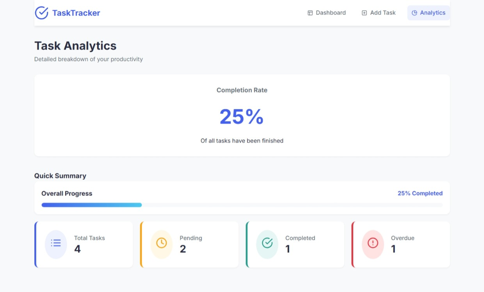

# 🎓 Student Task Tracker

A full-stack MERN (MongoDB, Express.js, React, Node.js) application designed to manage and track daily student, academic, and internship tasks efficiently. Features a responsive Kanban board, dynamic progress tracking, overdue detection, real-time statistics, and instant search & filtering.

---

## 📸 Screenshots

| 📊 Dashboard & Stats | 📋 Kanban Task Board |
| :---: | :---: |
|  |  |

| 📝 Add / Edit Task Modal | 🌐 Full Application Overview |
| :---: | :---: |
|  |  |

---

## ✨ Features

- **📋 Interactive Kanban Board**: Visual 3-column layout (**Pending**, **In Progress**, **Completed**) to seamlessly organize and track task progression.
- **📈 Dynamic Progress Bar**: Real-time visual progress indicator automatically calculating the percentage of completed tasks.
- **⚡ Task Analytics & Summary**: Instant dashboard counters for Total Tasks, Pending, Completed, and Overdue tasks.
- **⏰ Overdue Task Detection**: Automatic backend and frontend detection that flags tasks exceeding their deadline.
- **🔍 Advanced Search & Filter**: Real-time debounced text search (title/description) paired with status and priority filters.
- **🎯 Priority Tagging**: Color-coded badges for **High**, **Medium**, and **Low** priorities.
- **🛡️ Robust Validation**: End-to-end input validation on both client and server schemas to ensure data integrity.
- **📱 Fully Responsive Design**: Mobile-first, fluid layout optimized for phones, tablets, and desktop screens.

---

## 🛠️ Tech Stack

- **Database**: MongoDB Atlas (Mongoose ODM)
- **Backend**: Node.js, Express.js (ES Modules, RESTful API)
- **Frontend**: React 18, Vite, React Router, React Icons, Modern CSS
- **HTTP Client**: Axios

---

## 📂 Project Structure

```
student-task-tracker/
├── client/                     # React Frontend (Vite)
│   ├── public/                 # Static assets
│   ├── src/
│   │   ├── components/         # Reusable React components (TaskForm, TaskList, TaskStats, etc.)
│   │   ├── services/           # Axios API service layer
│   │   ├── App.jsx             # Root component & state management
│   │   ├── main.jsx            # Application entry point
│   │   └── index.css           # Global modern CSS styling
│   ├── package.json
│   └── .env.example
│
├── server/                     # Node.js + Express Backend
│   ├── config/                 # MongoDB database connection configuration
│   ├── controllers/            # Controller logic for tasks
│   ├── middleware/             # Error handling middleware
│   ├── models/                 # Mongoose schemas & models (Task.js)
│   ├── routes/                 # Express API routes
│   ├── seed.js                 # Database seeder script with demo tasks
│   ├── server.js               # Express application entry point
│   ├── package.json
│   └── .env.example
│
├── screenshots/                # Application UI screenshots
├── README.md                   # Project documentation
└── .gitignore
```

---

## ⚙️ Environment Configuration

Set up environment variables before starting the server and client.

### Backend (`server/.env`)
```env
PORT=5000
MONGO_URI=mongodb+srv://<username>:<password>@cluster.mongodb.net/task-tracker?retryWrites=true&w=majority
```

### Frontend (`client/.env`)
```env
VITE_API_URL=http://localhost:5000/api
```

---

## 🚀 Getting Started

Follow these steps to run the application locally from a fresh clone.

### 1. Clone the Repository
```bash
git clone https://github.com/namanraid65/-Student-Task-Tracker.git
cd -Student-Task-Tracker
```

### 2. Backend Setup
```bash
cd server
npm install

# Create server/.env from .env.example and configure your MongoDB connection string
# Run the development server:
npm run dev
```
> The server will start on `http://localhost:5000`.

#### (Optional) Seed Sample Tasks
To populate your MongoDB database with 10 sample tasks:
```bash
npm run seed
```

### 3. Frontend Setup
Open a new terminal window:
```bash
cd client
npm install

# Run the frontend development server:
npm run dev
```
> The React app will start on `http://localhost:5173`.

---

## 📡 API Endpoints

| HTTP Method | Endpoint             | Description |
|:------------|:---------------------|:------------|
| `GET`       | `/api/tasks`         | Retrieve all tasks (supports `search`, `status`, and `priority` queries) |
| `POST`      | `/api/tasks`         | Create a new task |
| `PUT`       | `/api/tasks/:id`     | Update an existing task by ID |
| `DELETE`    | `/api/tasks/:id`     | Delete a task by ID |
| `GET`       | `/api/tasks/stats`   | Retrieve aggregate statistics (Total, Pending, Completed, Overdue) |

---

## 🔍 Architecture & Implementation Details

- **Layered Architecture**: Follows a clean separation of concerns. Routes handle routing, controllers encapsulate business logic, and Mongoose handles database access with validation rules.
- **Database Schema**: Enforces strict data types, required fields, and enum validation (`status`: Pending/In Progress/Completed, `priority`: Low/Medium/High) on the `Task` model.
- **Centralized Error Handling**: Express middleware intercepts runtime errors and returns structured, consistent JSON error responses.
- **Dynamic Overdue Calculation**: Overdue status is evaluated based on `dueDate` compared against the current date for uncompleted tasks.
- **Responsive Layout**: Designed with CSS Grid and Flexbox for high performance across all viewport sizes without bulky UI frameworks.

---

## 🤖 AI Usage

AI tools were used for guidance in planning folder architecture, UI styling ideas, validation logic, and documentation formatting. All application code, controllers, components, and schema definitions have been verified, reviewed, and tested.
